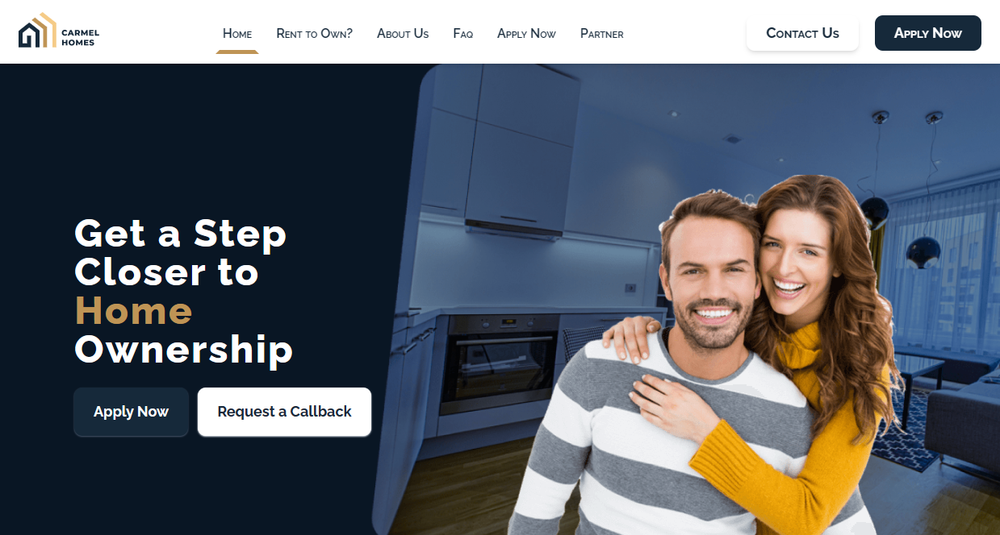
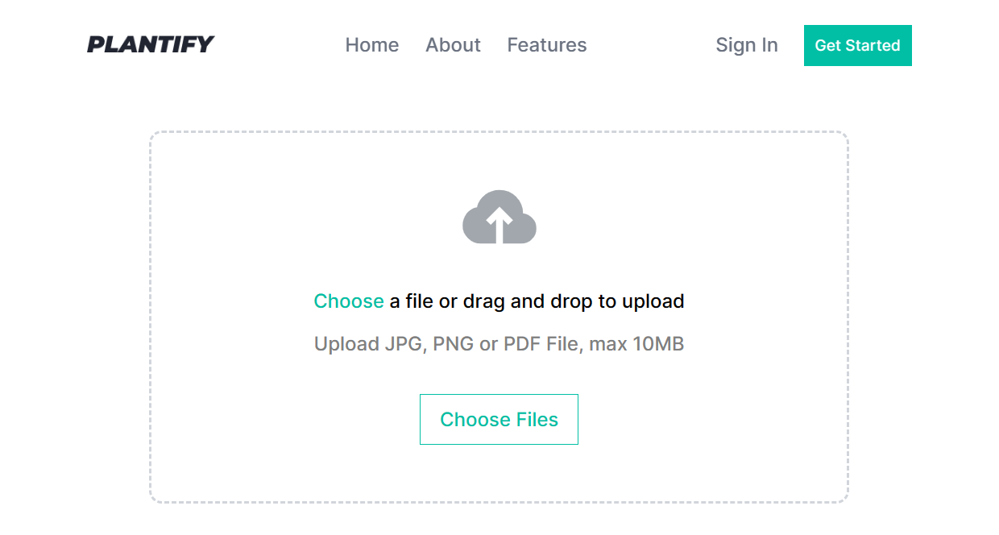
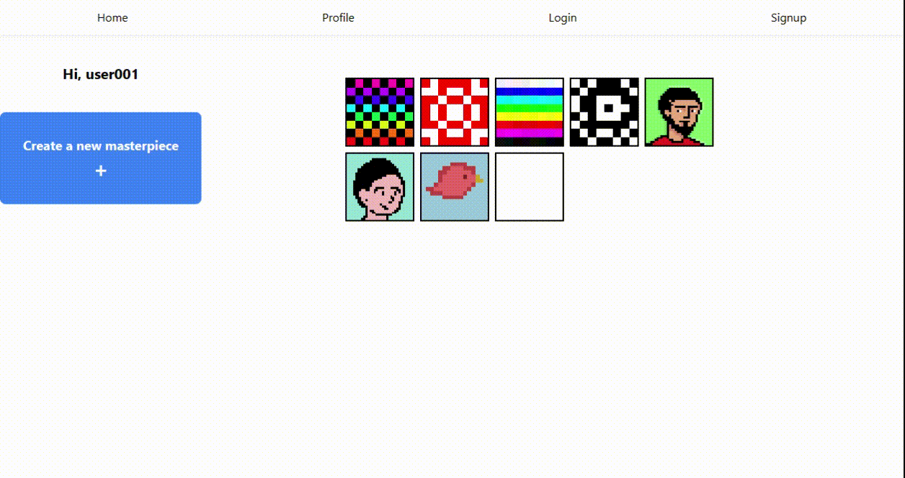
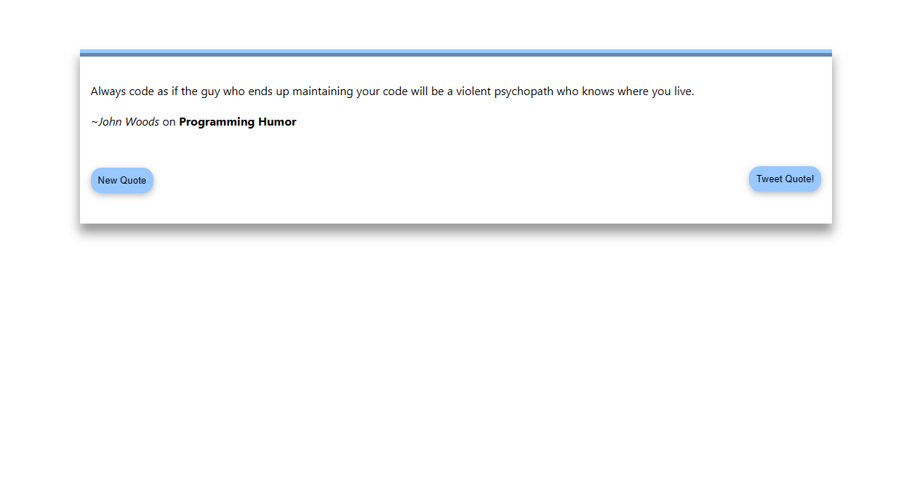

  

  

  
  

<h1 align="center">
  Welcome, internet stranger
  
</h1>

  It appears you've stumbled across my portfolio. Please, stick around. Browse a repo, maybe raise an issue, maybe leave a star. I'm open to collaborations, contract work and employment so don't be shy, feel free to reach out :)

## :mailbox: How to Reach Me :

- 

- 

## :fire: My Stats :

## :hammer_and_wrench: My Arsenal :

  
  
  
  
  
  
  
  
  
  
  
  
  
  
  
  
  

## :push_pin: My Affiliated Projects :

<table bordercolor="#66b2b2">
  
  <tr>
    <td width="50%" valign="top">
      <h3 align="center">Carmel Homes</h3>
       
      
       
      

        
         
      

      
<strong>React, Zustand, TailwindCSS </strong> - Carmel Homes Limited is a real estate company that offers a comprehensive rent-to-own program. On the company website, interested potential home owners can learn about the program and apply or book a callback. Investors and other property experts are invited to partner with the company.

    </td>
    <td width="50%" valign="top">
      <h3 align="center">Plantify</h3>
       
      
       
      

        
         
      

      
<strong>React, SCSS </strong> -  A plant identification web app

    </td>
  </tr>
  
  <tr>
    <td width="50%" valign="top">
      <h3 align="center">Pixelite</h3>
       
      
       
      

        
         
      

      
<strong>React, TailwindCSS</strong> - A pixel art creation web app.

    </td>
    <td width="50%" valign="top">
      <h3 align="center">Random Quotes Generator</h3>
       
      
       
      

        
         
      

      
<strong>React, CSS </strong> - A random quote generator

    </td>
  </tr>
</table>
