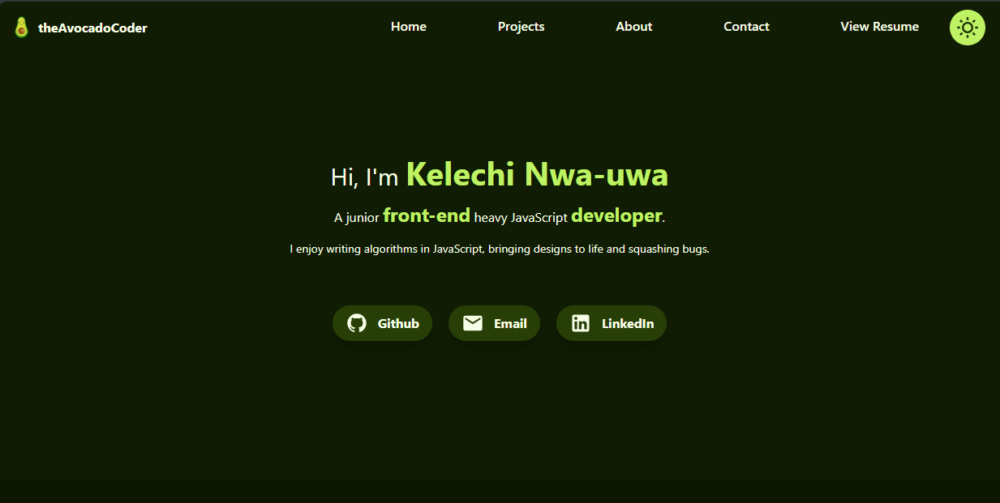

# theAvocadoCoder Portfolio Site

## Overview

Welcome to my portfolio site! This website serves as a showcase of my work and a central hub where you can find information about me. Created using HTML, Tailwind CSS, and JavaScript, the site features an avocado-themed design inspired by my GitHub username, 'theavocadocoder.' It includes a light and dark mode toggle, fully mobile-responsive design, and sections covering my projects, about me, and how to contact me.

## Technologies Used

- **HTML, Tailwind CSS, JavaScript**: The core technologies for building the portfolio.
- **pdf.js Library**: Utilized for rendering the PDF resume on the site.
- **Web3Forms**: Integrated for handling the contact form and sending messages to my email address.

## Design Considerations

- **Avocado Theme**: Inspired by the avocado theme, the light mode reflects a guacamole aesthetic, while the dark mode features dark greens and neon accents for a techy vibe.
- **Responsive Design**: Ensured that the site is fully responsive, providing an optimal viewing experience across various screen sizes.

## How to Explore the Portfolio

1. Visit the portfolio site by clicking [here](https://agile-learning-institute.github.io/member-kay-portfolio/).
2. Toggle between light and dark modes to experience different visual themes.
3. Navigate through the hero, projects, about, and contact sections.
4. Explore project cards, view live sites, check source code, and interact with the contact form.
5. Send me a message via my contact form.
6. Access my resume and optionally download it.

## Site Features

1. **Hero Section**: Contains a brief bio with links to my GitHub, LinkedIn, and email.
2. **Projects Section**: Features project cards with live site images, project descriptions, and buttons for accessing live sites and source code.
3. **About Section**: Includes an image, a bio, and a list of technologies I use.
4. **Contact Section**: Presents a little writeup and a contact form that utilizes Web3Forms for sending messages to my email.
5. **Resume**: Access the resume section through the navigation, view the resume on the screen, and optionally use the provided button to download the resume.

## Acknowledgments

### Web3Forms

The contact form sends messages to my email address using Web3Forms, a free platform for receiving messages from site visitors. You can find out more about them [here](https://web3forms.com/).

### PDF.js

The PDF.js library is an open source project by Mozilla whihc I utilized for rendering my resume PDF on the site. You can find out more about them on [their website](https://mozilla.github.io/pdf.js/).

## About Me

I am a junior developer with a passion for combining technology and creativity. I am enthusiastic about creating dynamic and user-friendly web sites and web applications.

I am not a designer but aimed for a visually appealing and functional design inspired by dribbble designs for developer portfolios. The avocado theme adds a personal touch to the overall aesthetic.

Feel free to reach out if you have any questions or feedback!

Thank you for visiting my portfolio site! 🥑✨
